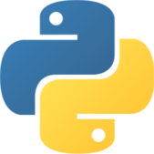

    <h1>Help for Mu</h1>
    Mu is a simple code editor for beginner
    programmers. It's written in Python and works on Windows, OSX, Linux and Raspberry Pi.

# Help

## Starting Mu

In order to start the Mu, just click on the Mu icon to run the program. 
To make sure the Thunderboard Sense is connected, open the Repl and press enter. ">>>" should show up. 

## Mu Buttons

### New

Click the new button to start in a new file in mu. This won't damage your old files - a fresh place to work.

### Load

Load a file - your old work or some other python file to work on.

### Save

Saves your work so you can keep it for later and not loose it if you loose power. Do this often!

### Flash

Run your code on the Thunderboard Sense. This does not store the code on the Thunderboard Sense. 

### Files

Show the files stored on your Thunderboard.

### Repl

The repl is a way of typing stuff and seeing the Thunderboard do something immediately. It is an abbreviation for "read-eval-print-loop".

### Zoom In

Make the letters bigger

### Zoom Out

Make the letters smaller

### Check

This button will check your code and underline errors you have made. Worth doing before you flash your code.

### Help

Show help - should be this help.

### Quit

Press this when you are done with Mu. Mu will make sure you've saved your work if you want to keep it.
